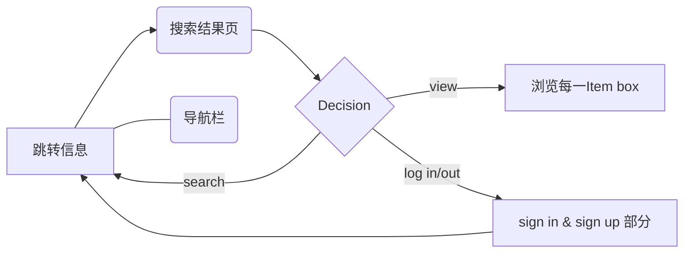
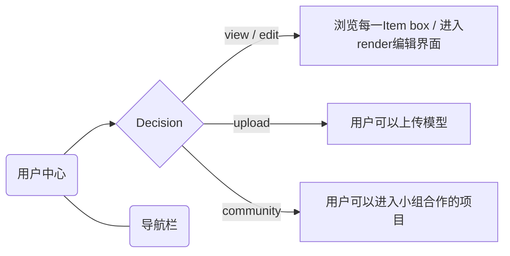
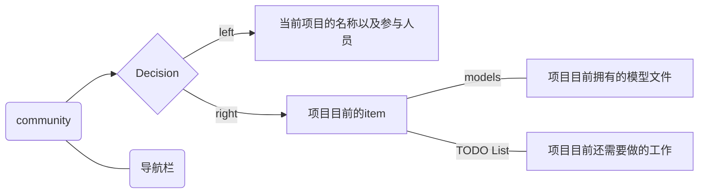
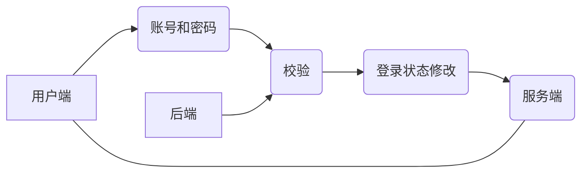
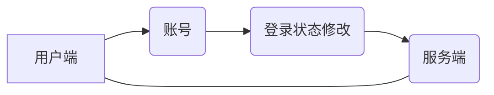
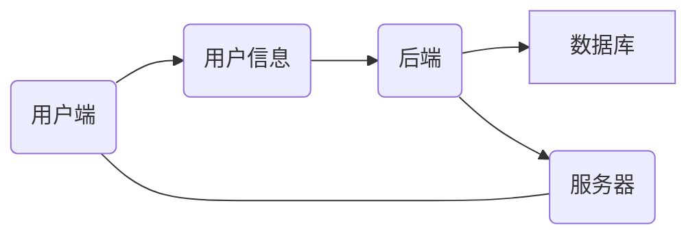
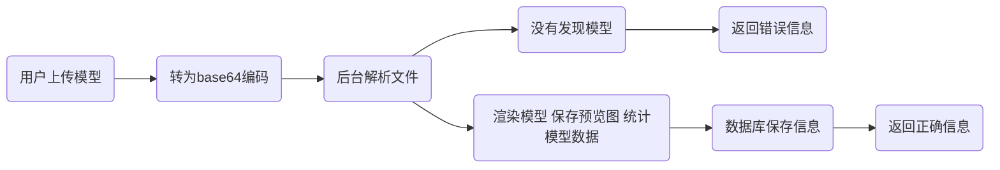

##  总体架构

#### 语言与框架选择

在后端我们使用了 SQLite + Flask + Chromium 等提供了 REST API，以便前端调用。

在前端我们采取了 React + TypeScript 的代码。选择 React 主要是看重其庞大的组件库，方便我们快速开发，迭代更新：前期把更多精力放在页面逻辑而不是设计上，在之后再优化设计。

使用了 TypeScript 的出于以下考虑：

- 类型即注释：作为一个长达3个月的项目，TS 能帮助我们回忆起每个函数具体功能，而不需要额外注释。
- 合作：TS 使得团队合作成为可能，编译期即能检查调用错误，否则每一个暴露的函数都需要文档。
- 前后端解耦&协作：前后端共同开发 `api.ts` 文件，定义前后端交互的 API，对于前端来说每一个API返回参数是确定可靠的，对于后端来说前端的数据需求是在声明里类型是清晰的

可以说，没有 TS 是不可能支撑起前后端近万行的代码，也不可能让小组无缝合作。


#### 前后端交互

前后端的API 主要分为以下几类：

| 类别     | 解释                                           | API 格式           | 统计* |
| -------- | ---------------------------------------------- | ------------------ | ----- |
| 用户操作 | 注册、登录、更新信息                           | `/api/user/*`      | 6     |
| 枚举     | 枚举用户的模型、推荐模型、类别下所有模型、社区 | `/api/list/*`      | 5     |
| 模型操作 | 模型计数、上传、更新渲染配置等                 | `/api/model/*`     | 3     |
| 社区操作 | 给社区贡献模型、更新技术文档                   | `/api/community/*` | 4     |
| 搜索     | 检索模型                                       | `/api/search`      | 1     |

*: 统计是指这个类别的 API 有多少个


#### Mock

通常需求是产生在前端，而后端跟进提供 API，但是前端开发完成功能需要测试，然后对接后端，通常前端的做法使用 Mock 来制作一份数据，来检查前端的逻辑是否正确、排版是否有问题等。

前端甚至有自己的一个简单的 Mock Server 来满足测试需求。


#### Git 协作

前端和后端使用了 Git 协作，配合 VSCode 能很好地解决冲突。大大增强了小组并行开发的能力。


## 前端架构

此处主要介绍一下前端功能的设计

#### 主页包含的功能（/）

* 路由：属于网页的根目录

* 可跳转的页面

  | 可跳转的页面     | 触发方式                             |
  | ---------------- | ------------------------------------ |
  | 搜索结果页       | 进行搜索或者点击对应目录logo         |
  | 用户中心         | 先进行登录，然后在导航按钮中点击跳转 |
  | 用户修改信息页面 | 先进行登录，然后在导航按钮中点击跳转 |

  ```mermaid
  sequenceDiagram
      主页[/]->>搜索页面[/catalog]: 通过搜索或点击对应条目跳转
      alt search bar
      主页[/]->>搜索页面[/catalog]: 调用后端API，在/catalog返回结果
      else click catalog
      主页[/]->>搜索页面[/catalog]: 将搜索关键词为目录，并搜索
      end
      opt return
      搜索页面[/catalog]->>主页[/]: can return from top
      end
      主页[/]->>用户中心[/profile]:登录，拿到后端返回信息
      opt return
      用户中心[/profile]->>主页[/]: can return from top
      end
  ```

* 主页的内容和功能

  1. 每一个目录在主页中都会有对应的展示栏，其中每一个展示栏都会有8个的具体的模型推荐
  2. 可以在右上角登录
  3. 可以进行搜索跳转
  4. 可以显示当前网站所含有的的模型总数

#### 搜索结果页（/catalog）

* 页面的内容和功能
  1. 显示搜索结果
  2. 在上方显示每个种类的logo方便跳转
  3. 有搜索栏可以再次搜索




#### 用户页面（/profile）

* 页面的内容和功能
  1. 显示用户目前已拥有和上传的`所有模型`
  2. 显示用户个人的具体`信息`，包括ID 名称，昵称，注册时间，拥有模型数……
  3. 提供对每个模型的编辑和删除`按钮`，以供用户进行操作




#### 合作community页面（/profile/community）

* 显示合作小组目前具有的`成员`信息
* 显示合作小组目前已有的项目`模型`
* 显示合作小组目前还需要完成的`工作`




#### 用户信息修改页面（/profile/edit）

* 可对当前用户的个人信息进行编辑，包括用户的头像，简介等

#### 精致的Item box

* 显示模型的`预览图`，并支持放大查看模型预览图
* 显示模型文件的`名字`，以及作者名称
* `点击`后显示详细的渲染页面

#### 模型的render 3D预览（\<DetailPanel\>）

* 侧栏显示模型的`具体信息`，如名称、顶点数、三角形面数……
* 主显示框显示模型的 `3D 预览`界面，并对用户提供交互操作
* 下方栏目包含网站用户对该模型的`评论`信息（如果有）

#### 模型的render edit编辑（/model/edit）

* 在模型的render 3D 预览功能上添加了
  1. `光源`的编辑能力：如光源类型，光源颜色
  2. `天空盒`的编辑能力
  3. `光照模式`的保存
  4. 更改对应模型的`预览图`
  5. `下载保存`当前窗口的预览图

#### 网页最上方导航窗口

* 提供了返回主页面的快捷键，`“3DModel”`的logo
* 提供了`搜索框`以供用户在不同路由中方便搜索
* 提供了用户导航按钮`"welcome"`，可随时跳转至用户中心


## 后端架构

#### 数据库设计：

###### 模型数据库设计：

1、model表

| 属性          | 数据类型    | 约束                        |
| ------------- | ----------- | --------------------------- |
| model_ID      | INTEGER     | PRIMARY KEY (Autoincrement) |
| model_name    | VARCHAR(20) |                             |
| type_name     | VARCHAR(20) |                             |
| publish_time  | text        |                             |
| num_triangles | INTEGER     |                             |
| num_vertices  | INTEGER     |                             |
| animated      | INTEGER     |                             |
| owner_ID      | INTEGER     |                             |
| url           | VARCHAR(50) |                             |

2、tag表

| 属性     | 数据类型     | 约束                                    |
| -------- | ------------ | --------------------------------------- |
| model_ID | INTEGER      | FOREIGN KEY REFERENCE model（model_ID） |
| tag_name | VARCHAR(100) |                                         |

3、user表

| 属性         | 数据类型     | 约束        |
| ------------ | ------------ | ----------- |
| username     | TEXT         | PRIMARY KEY |
| password     | TEXT         |             |
| nickname     | TEXT         |             |
| biography    | VARCHAR(256) |             |
| location     | TEXT         |             |
| email        | TEXT         |             |
| avatar       | TEXT         |             |
| introduction | VARCHAR(128) |             |


#### 用户管理

###### 登录和注销

用户登录的功能通过session来实现。登录过程，用户输入用户名和密码，后端将其与经由SHA256加密后的字符串进行比对。如果登陆成功，则在session存储相关的信息。注销过程与之相反，服务器从session里清除相关用户登录信息即可。

- 登录



- 注销



###### 用户信息修改

通过与前端约定好的数据格式，后端根据当前登录状态对用户信息直接进行修改。



#### 模型上传

前台以base64编码的形式上传文件，后台接受并进行解析，如果有模型则正确渲染并保存到数据库，否则向前台返回错误。

